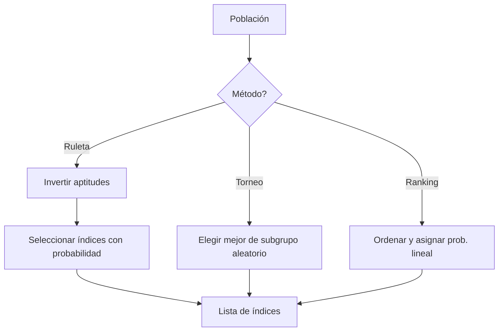
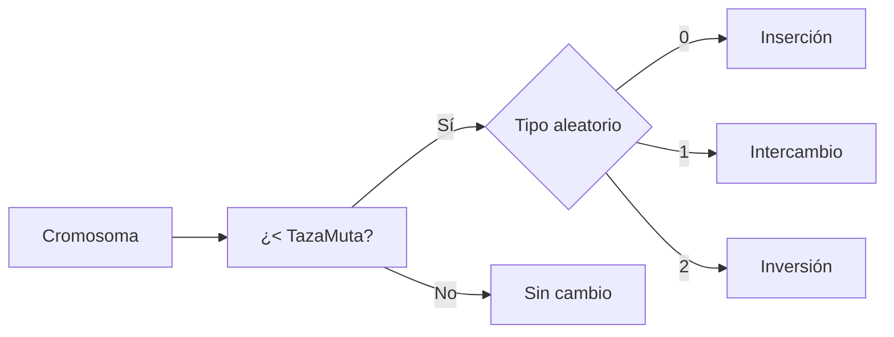
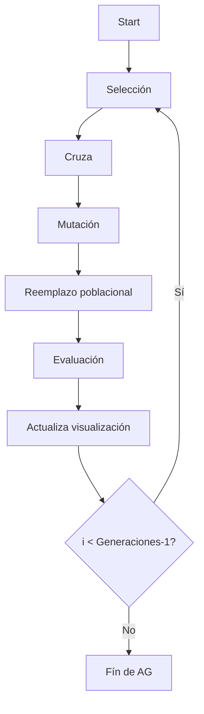
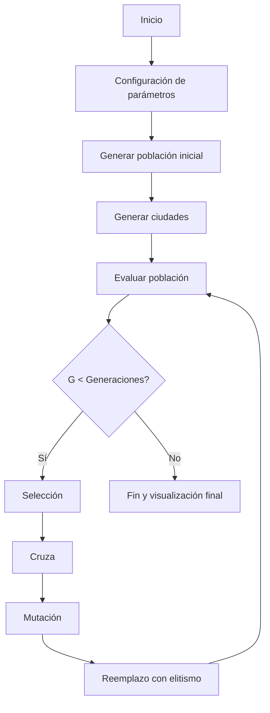

# Documentación del Algoritmo Genético Propio

Este documento se centra exclusivamente en la implementación manual del algoritmo genético presente en el proyecto, cuyos componentes principales se encuentran en los archivos `AlgoritmoGenetico.cs`, `Cromosoma.cs` y `Ciudad.cs`. Se describen a fondo cada uno de los elementos del algoritmo, se provee pseudocódigo y diagramas en formato Mermaid para facilitar la comprensión.

---

## 1. Representación de individuos

Cada individuo de la población, denominado *cromosoma*, se modela mediante la clase `Cromosoma`:

```csharp
public class Cromosoma
{
    private List<int> recorrido = new List<int>();
    private float aptitud = 0.0f;
    // getters / setters
}
```

* **Genoma**: `List<int> recorrido` representa una permutación de índices de ciudades (0..Ciudades-1). La ordenación define el recorrido que un viajante realiza.
* **Aptitud**: valor flotante almacenado en `aptitud` calculado como la distancia total del recorrido. En esta implementación, menor distancia significa mejor.

Adicionalmente, la clase `Ciudad` encapsula la posición de cada punto y un identificador, aunque no forma parte directa del genoma.

---

## 2. Inicialización de población

La función `makePopulation()` de `AlgoritmoGenetico` crea la población inicial:

```csharp
public void makePopulation() {
    poblacion = new List<Cromosoma>();
    for (int i = 0; i < Individuos; i++) {
        Cromosoma tmp = new Cromosoma();
        for (int j = 0; j < Ciudades; j++) {
            int num = rnd.Next(0, Ciudades);
            while (tmp.Recorrido.Contains(num)) {
                num = rnd.Next(0, Ciudades);
            }
            tmp.Recorrido.Add(num);
        }
        poblacion.Add(tmp);
    }
}
```

* **Aleatoriedad**: se utiliza `System.Random` para generar índices únicos.
* **Garantía de permutación**: bucle `while` asegura que cada ciudad aparece solo una vez.

Pseudocódigo equivalente:

```text
func makePopulation():
    poblacion = []
    for i in 1..Individuos:
        cromosoma = new Cromosoma()
        while cromosoma.recorrido.size < Ciudades:
            gene = randInt(0, Ciudades-1)
            if gene not in cromosoma.recorrido:
                append gene
        append cromosoma a poblacion
```

---

## 3. Función de fitness

El método `calculateAptitud(Cromosoma)` calcula la distancia total del recorrido y la asigna al campo `Aptitud`:

```csharp
private void calculateAptitud(Cromosoma cromosoma) {
    float distanciaTotal = 0f;
    for (int i = 0; i < cromosoma.Recorrido.Count - 1; i++) {
        int ciudadActual = cromosoma.Recorrido[i];
        int ciudadSiguiente = cromosoma.Recorrido[i + 1];
        distanciaTotal += Vector3.Distance(
            cities[ciudadActual].Ubicacion,
            cities[ciudadSiguiente].Ubicacion
        );
    }
    // retorno a inicio
    if (cromosoma.Recorrido.Count > 0) {
        distanciaTotal += Vector3.Distance(
            cities[cromosoma.Recorrido[cromosoma.Recorrido.Count - 1]].Ubicacion,
            cities[cromosoma.Recorrido[0]].Ubicacion
        );
    }
    cromosoma.Aptitud = distanciaTotal;
}
```

* **Minimización**: se utiliza la distancia como aptitud; el algoritmo busca cromosomas con aptitud mínima.
* **Evaluación de toda la población**: `evaluatePopulation()` itera por cada cromosoma y llama a `calculateAptitud`.

Pseudocódigo:

```text
func evaluatePopulation():
    for crom in poblacion:
        crom.aptitud = 0
        for i in 0..(ciudades-2):
            a = ciudades[crom.recorrido[i]]
            b = ciudades[crom.recorrido[i+1]]
            crom.aptitud += distance(a, b)
        # agregar retorno
        crom.aptitud += distance(ciudades[last], ciudades[first])
```

---

## 4. Método de selección

La selección se abstrae en el método `seleccionar()` que delega según el parámetro `MetSelec`:

```csharp
private List<int> seleccionar() {
    switch (MetSelec) {
        case 0: return seleccionPorRuleta();
        case 1: return seleccionPorTorneo();
        case 2: return seleccionPorRanking();
        default: return seleccionPorRuleta();
    }
}
```

### Ruleta

Invierten las aptitudes (ya que se minimiza):

```csharp
float maxApt = poblacion.Max(c => c.Aptitud);
List<float> aptInv = poblacion.Select(c => maxApt - c.Aptitud).ToList();
...
for i in 0..Individuos-1:
    prob = rndDouble() * sum(aptInv)
    acumulado = 0
    for j in 0..poblacion.Count-1:
        acumulado += aptInv[j]
        if acumulado >= prob:
            seleccionados.Add(j)
            break
```

### Torneo

Se crea un subgrupo de tamaño `tamanoTorneo = max(2, Individuos/4)` y se elige el mejor:

```text
for i in 1..Individuos:
    mejor = rand(0, poblacion.size-1)
    for j in 2..tamanoTorneo:
        cand = rand(...)
        if poblacion[cand].aptitud < poblacion[mejor].aptitud:
            mejor = cand
    seleccionados.add(mejor)
```

### Ranking

Ordena por aptitud y asigna probabilidades lineales basadas en el rango:

```text
poblOrdenada = ordenar(poblacion)
rangoTotal = (N*(N+1))/2
for i in 0..N-1:
    rankings[i] = (i+1)/rangoTotal
for k in 1..Individuos:
    prob = rnd()
    acumulado = 0
    for j in 0..N-1:
        acumulado += rankings[j]
        if acumulado >= prob:
            seleccionados.add(poblOrdenada[j].indice)
            break
```

Un diagrama Mermaid de selección:



---

## 5. Método de cruce

La cruza se realiza par a par en `reproducir(indicesSeleccionados)` y llama a `cruzar()`:

```csharp
switch (MetCruza) {
    case 0: return CruzePMX(padre1, padre2);
    case 1: return CruceOX(padre1, padre2);
    case 2: return CruceCX(padre1, padre2);
    default: return CruzePMX(padre1, padre2);
}
```

### PMX (Partially Mapped Crossover)

Selecciona un segmento aleatorio y mapea elementos para mantener la permutación.

### OX (Order Crossover)

Copia una subsecuencia y completa con los genes del segundo padre en orden.

### CX (Cycle Crossover)

Identifica ciclos entre padres para construir al hijo.

Pseudocódigo general de reproducción:

```text
func reproducir(indices):
    nuevos = []
    for k in 0..indices.size-1 step 2:
        if k+1 < indices.size:
            padre1 = poblacion[indices[k]]
            padre2 = poblacion[indices[k+1]]
            hijoGenes = cruzar(padre1.recorrido, padre2.recorrido)
            nuevo = Cromosoma(hijoGenes)
            nuevos.add(nuevo)
        else:
            clones ultimo impares
    garantizar tamaño = Individuos (clonar aleatorio)
    return nuevos
```

---

## 6. Método de mutación

La mutación se aplica en `mutar(List<Cromosoma>)`: cada cromosoma tiene probabilidad `TazaMuta` de padecer un operador aleatorio entre:

* **Inserción**: toma un elemento y lo reubica en otra posición.
* **Intercambio**: intercambia dos posiciones.
* **Inversión**: invierte un segmento consecutivo.

Código de mutación por inserción (igual para otros):

```csharp
int index1 = random.Next(0, Recorrido.Count);
int index2 = random.Next(0, Recorrido.Count);
while(index1 == index2) index2 = random.Next(...);
int element = Recorrido[index1];
if (index1 < index2) {
    Recorrido.RemoveAt(index1);
    Recorrido.Insert(index2 - 1, element);
} else {
    Recorrido.RemoveAt(index1);
    Recorrido.Insert(index2, element);
}
```

Mermaid de mutación:



---

## 7. Control de generaciones

El ciclo evolutivo completo se implementa en `evolve()`:

```csharp
for i=0 to Generaciones-1:
    generacionActual = i
    indices = seleccionar()
    nuevos = reproducir(indices)
    mutar(nuevos)
    reemplazarPoblacion(nuevos)
    evaluatePopulation()
    señalVisualizacion(best())
    Thread.Sleep(10)
```

* **Elitismo** en `reemplazarPoblacion`: conserva una fracción (`eliteSize = max(1, Individuos/10)`) de los mejores antes de añadir los nuevos.
* **Visualización**: se guarda el mejor cromosoma para ser renderizado en el hilo principal.

Mermaid del bucle genérico:



---

## 8. Condiciones de parada

La única condición de parada explícita es alcanzar el número de generaciones configurado (`Generaciones`). El algoritmo corre en un hilo que termina tras completar el bucle. Adicionalmente, el método `stop()` permite abortar la ejecución desde otro hilo estableciendo `isRunning = false` y esperando la unión del hilo.

---

## 9. Complejidad computacional

Asumiendo:
* `N`: tamaño de la población (`Individuos`)
* `M`: número de ciudades (`Ciudades`)
* `G`: número de generaciones

**Inicialización**: O(N × M²) por verificación de unicidad al generar cromosomas.

**Evaluación**: cada evaluación de aptitud toma O(M); evaluar la población es O(N × M).

**Selección**: depende del método:
* Ruleta: O(N²) en peor caso (cada selección recorre la población), total O(N²).
* Torneo: O(N × k) donde k = tamanoTorneo ≈ N/4 ⇒ O(N²).
* Ranking: O(N log N) por ordenamiento + O(N²) en proceso de selección.

**Cruza/Mutación**: cada operador trabaja en tiempo O(M) y se aplica a ~N individuos ⇒ O(N × M).

**Reemplazo**: ordenar población O(N log N) + copiar élite O(N).

Por generación el costo dominante es O(N² + N × M). Por G generaciones: O(G × (N² + N × M)).

El uso de hilos reduce el impacto en la UI pero no disminuye la complejidad teórica.

---

## 10. Flujo completo del algoritmo (visión global)

Un diagrama resumido Mermaid:



Esta secuencia se ejecuta dentro de `AlgoritmoGenetico` y es controlada por `ControlAGPropio` desde la interfaz.

---

### Observaciones finales

La implementación manual ofrece transparencia en cada paso y facilita la modificación de operadores o la adición de nuevas estrategias de adaptación. Los pseudocódigos y diagramas incluidos pueden servir como apoyo en la descripción académica del algoritmo dentro de una tesis.

El documento puede ser ampliado para incluir métricas empíricas o ejemplos particulares de run, según sea necesario.